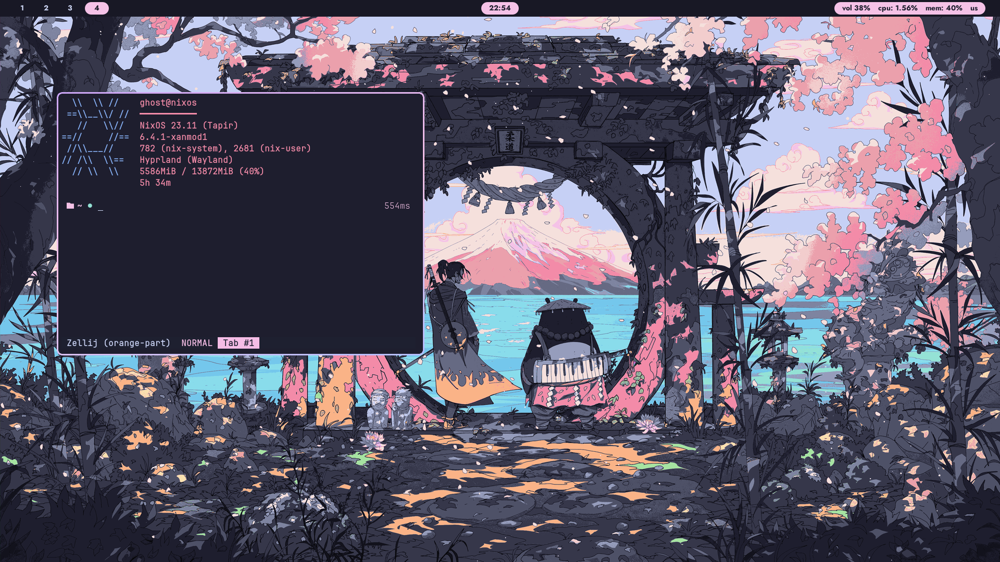

  

**Known issues**

- Nix can not create dir for hm, do it by yourself:
  `mkdir -p ~/.local/state/nix/profiles`

Where i'm stolen base config - https://github.com/samiulbasirfahim/Flakes

I'm learning confs from this people

- https://github.com/NotAShelf/nyx
- https://github.com/jsw08/nyxital/
- https://github.com/fufexan/dotfiles
- https://gitea.com/hezaki/Touka/
- https://github.com/rxyhn/yuki

neovim config - https://github.com/Tanish2002/neovim-config
